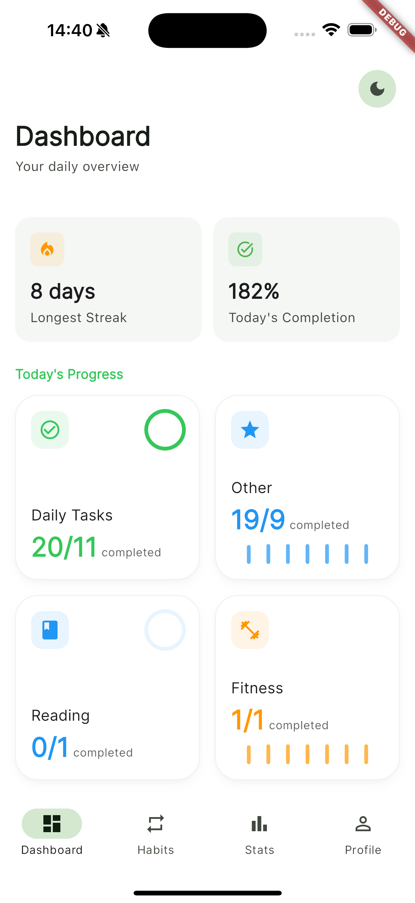
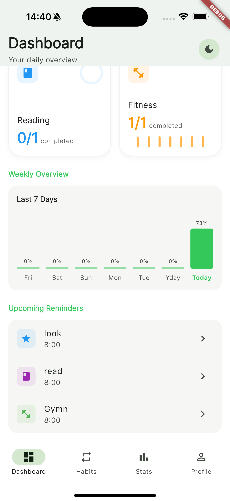
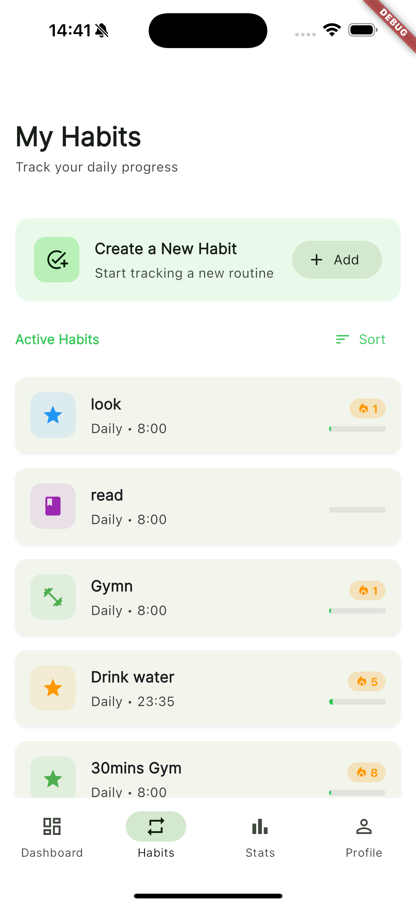
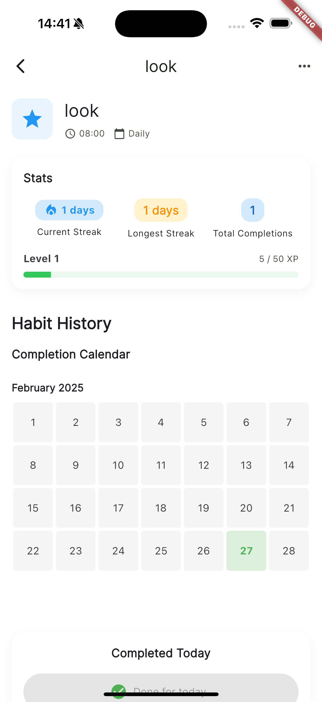
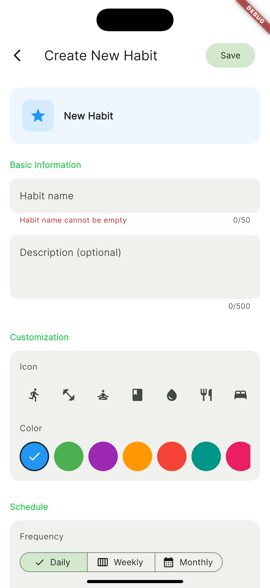
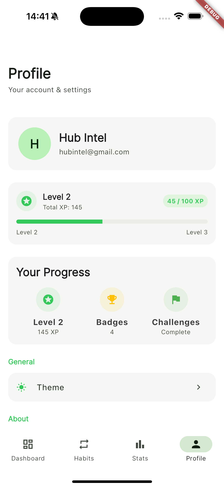
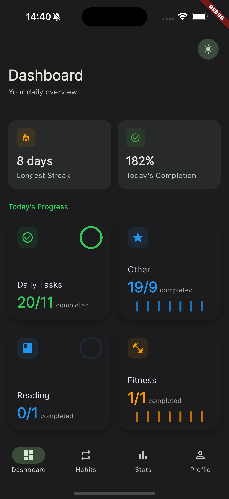
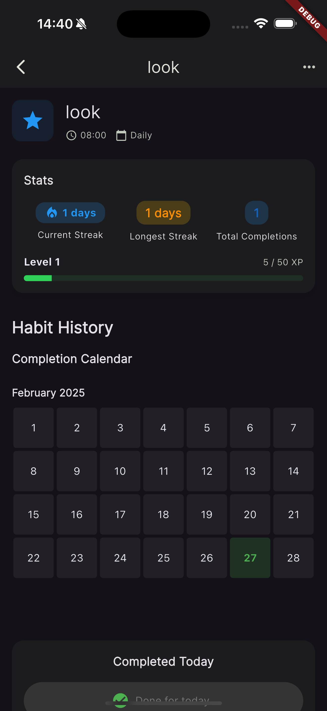

# Habit Hero

Link to the web version: https://habit-hro.web.app/

**Transform your life, one habit at a time**

Habit Hero is a comprehensive habit tracking application built with Flutter that helps users build positive habits, track their progress, and stay motivated through gamification elements.

## ✨ Features

### 🎯 Core Functionality
- **Habit Management**: Create, edit, and delete personalized habits
- **Flexible Scheduling**: Set habits as daily, weekly, or monthly
- **Custom Reminders**: Schedule notifications for each habit
- **Visual Customization**: Personalize habits with icons and colors

### 📊 Progress Tracking
- **Streak Tracking**: Monitor your current and longest streaks
- **Statistics Dashboard**: Visualize your habit completion data
- **XP & Leveling System**: Earn experience points as you complete habits

### 🏆 Gamification
- **Daily Challenges**: Complete special challenges for bonus rewards
- **Achievement System**: Unlock achievements as you reach milestones
- **Visual Progress**: Watch your habits level up as you stay consistent

### ⚙️ Advanced Features
- **Dark/Light Mode**: Choose your preferred theme
- **Cloud Sync**: Access your habits across multiple devices
- **Offline Support**: Full functionality without internet connection
- **Google Sign-In**: Easy authentication with your Google account

## 📱 Screenshots

| Dashboard | Weekly Overview | Habits |
|---------------|-----------|------------|
|  |  |  |

| Habit Details | Add Habit | Profile |
|-----------|------------|---------|
|  |  |  |

| Dashboard (Dark Mode) | Weekly Overview (Dark Mode) | Habit Details (Dark Mode) |
|---------------|-----------|------------|
|  |  |  |

## 🚀 Getting Started

### Prerequisites
- Flutter SDK (^3.5.3)
- Dart SDK (^3.5.3)
- Android Studio / VS Code with Flutter extensions
- A Supabase account for backend services

### Installation

1. Clone the repository
2. Install dependencies `flutter pub get`
3. Run `flutter pub run build_runner build` to generate the necessary files
4. Run `flutter run` to start the application

## 🛠️ Technical Architecture

### Frontend
- **Flutter**: Cross-platform UI framework
- **Riverpod**: State management
- **Google Fonts**: Custom typography
- **Lottie**: Fluid animations
- **FL Chart**: Data visualization

### Backend
- **Supabase**: Backend as a Service
  - Authentication
  - Database
  - Real-time sync
  
### Local Storage
- **Hive**: NoSQL database for offline data
- **Shared Preferences**: Simple key-value storage

### Authentication
- **Supabase Auth**: Email/password authentication
- **Google Sign-In**: OAuth integration

## 🔄 Data Synchronization

The app implements a robust offline-first approach:
1. All changes are stored locally in Hive
2. When online, data is synchronized with Supabase
3. Conflict resolution strategies ensure data integrity

## 🤝 Contributing

Contributions are welcome! Please feel free to submit a Pull Request.

1. Fork the repository
2. Create your feature branch (`git checkout -b feature/amazing-feature`)
3. Commit your changes (`git commit -m 'Add some amazing feature'`)
4. Push to the branch (`git push origin feature/amazing-feature`)
5. Open a Pull Request

## 📝 License

This project is licensed under the MIT License - see the [LICENSE](LICENSE) file for details.